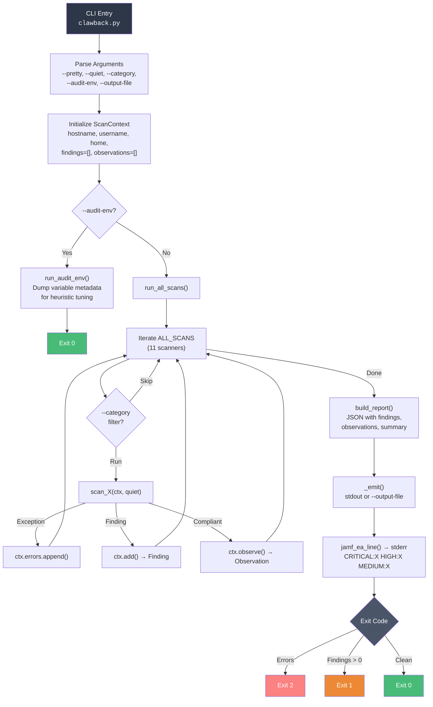
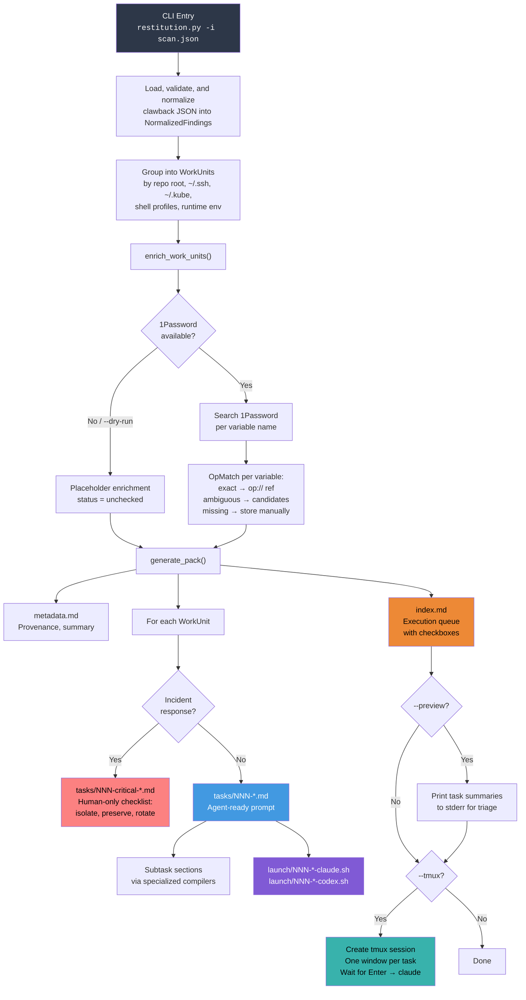

# Clawback Architecture

## Scanning Flow (`clawback.py`)

```mermaid
flowchart TD
    CLI["CLI Entry<br/><code>clawback.py</code>"] --> ParseArgs["Parse Arguments<br/>--pretty, --quiet, --category,<br/>--audit-env, --output-file"]
    ParseArgs --> InitCtx["Initialize ScanContext<br/>hostname, username, home,<br/>findings=[], observations=[]"]

    InitCtx --> AuditCheck{--audit-env?}
    AuditCheck -->|Yes| AuditMode["run_audit_env()<br/>Dump variable metadata<br/>for heuristic tuning"]
    AuditMode --> Exit0["Exit 0"]
    AuditCheck -->|No| RunAll["run_all_scans()"]

    RunAll --> ScanLoop["Iterate ALL_SCANS<br/>(11 scanners)"]

    ScanLoop --> CatFilter{--category<br/>filter?}
    CatFilter -->|Skip| ScanLoop
    CatFilter -->|Run| Scanner["scan_X(ctx, quiet)"]
    Scanner -->|Exception| ErrList["ctx.errors.append()"]
    Scanner -->|Finding| AddFind["ctx.add() → Finding"]
    Scanner -->|Compliant| Observe["ctx.observe() → Observation"]
    ErrList --> ScanLoop
    AddFind --> ScanLoop
    Observe --> ScanLoop

    ScanLoop -->|Done| BuildReport["build_report()<br/>JSON with findings,<br/>observations, summary"]
    BuildReport --> Emit["_emit()<br/>stdout or --output-file"]
    Emit --> JAMF["jamf_ea_line() → stderr<br/>CRITICAL:X HIGH:X MEDIUM:X"]
    JAMF --> ExitCode{Exit Code}
    ExitCode -->|Errors| Exit2["Exit 2"]
    ExitCode -->|Findings > 0| Exit1["Exit 1"]
    ExitCode -->|Clean| Exit0b["Exit 0"]

    style CLI fill:#2d3748,color:#fff
    style ExitCode fill:#4a5568,color:#fff
    style Exit0 fill:#48bb78,color:#fff
    style Exit0b fill:#48bb78,color:#fff
    style Exit1 fill:#ed8936,color:#fff
    style Exit2 fill:#fc8181,color:#fff
```

## Restitution Flow (`restitution.py`)

```mermaid
flowchart TD
    CLI["CLI Entry<br/><code>restitution.py -i scan.json</code>"] --> Ingest["Load, validate, and normalize<br/>clawback JSON into NormalizedFindings"]
    Ingest --> Group["Group into WorkUnits<br/>by repo root, ~/.ssh, ~/.kube,<br/>shell profiles, runtime env"]
    Group --> Enrich["enrich_work_units()"]

    Enrich --> OpCheck{1Password<br/>available?}
    OpCheck -->|No / --dry-run| Placeholder["Placeholder enrichment<br/>status = unchecked"]
    OpCheck -->|Yes| OpSearch["Search 1Password<br/>per variable name"]
    OpSearch --> OpResult["OpMatch per variable:<br/>exact → op:// ref<br/>ambiguous → candidates<br/>missing → store manually"]

    Placeholder --> Generate
    OpResult --> Generate

    Generate["generate_pack()"] --> MetaFile["metadata.md<br/>Provenance, summary"]
    Generate --> TaskLoop["For each WorkUnit"]

    TaskLoop --> IsIR{Incident<br/>response?}
    IsIR -->|Yes| IRTask["tasks/NNN-critical-*.md<br/>Human-only checklist:<br/>isolate, preserve, rotate"]
    IsIR -->|No| AgentTask["tasks/NNN-*.md<br/>Agent-ready prompt"]

    AgentTask --> Subtasks["Subtask sections<br/>via specialized compilers"]

    AgentTask --> Launchers["launch/NNN-*-claude.sh<br/>launch/NNN-*-codex.sh"]

    Generate --> Index["index.md<br/>Execution queue<br/>with checkboxes"]

    Index --> Preview{--preview?}
    Preview -->|Yes| PreviewOut["Print task summaries<br/>to stderr for triage"]
    Preview -->|No| TmuxCheck

    PreviewOut --> TmuxCheck{--tmux?}
    TmuxCheck -->|Yes| Tmux["Create tmux session<br/>One window per task<br/>Wait for Enter → claude"]
    TmuxCheck -->|No| Done["Done"]

    style CLI fill:#2d3748,color:#fff
    style IRTask fill:#fc8181,color:#000
    style AgentTask fill:#4299e1,color:#fff
    style Launchers fill:#805ad5,color:#fff
    style Index fill:#ed8936,color:#000
    style Tmux fill:#38b2ac,color:#000
```
